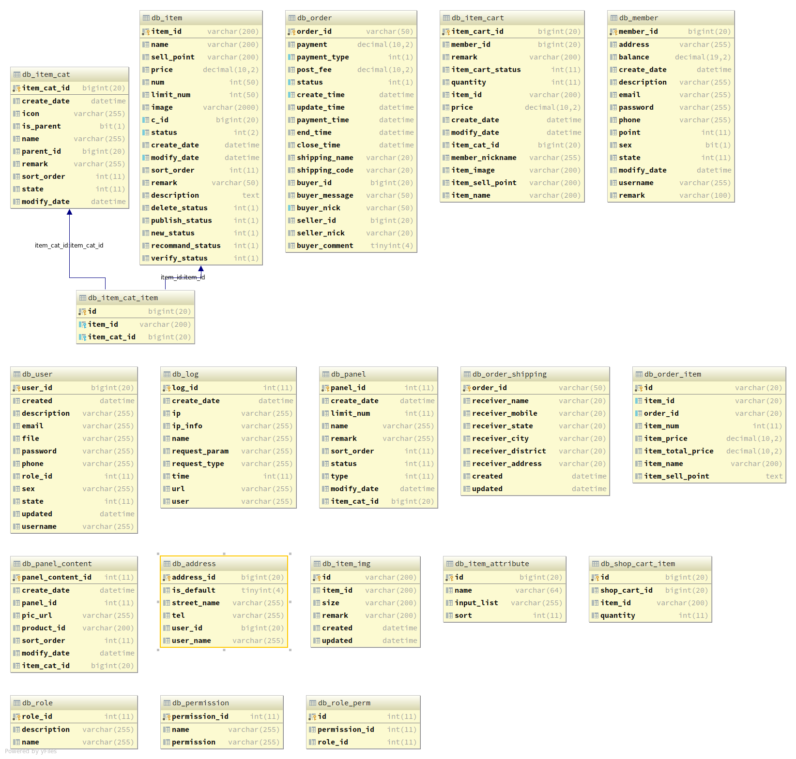
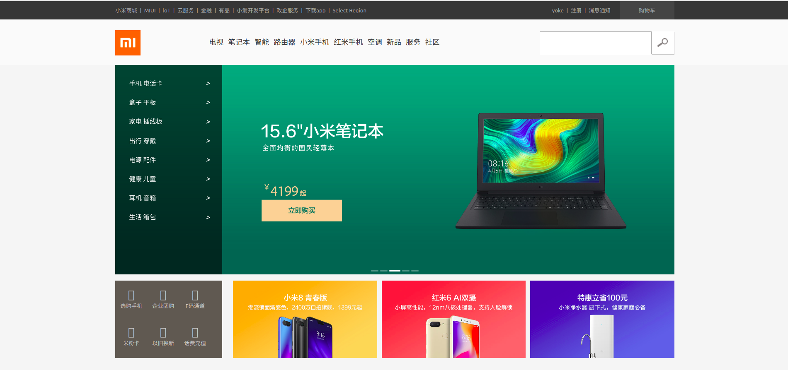
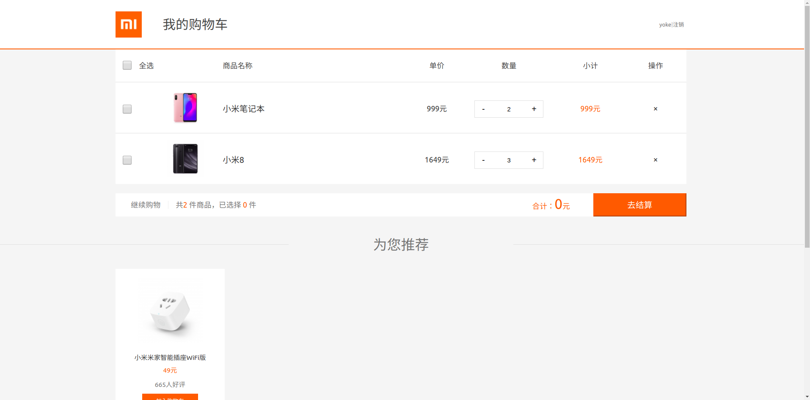
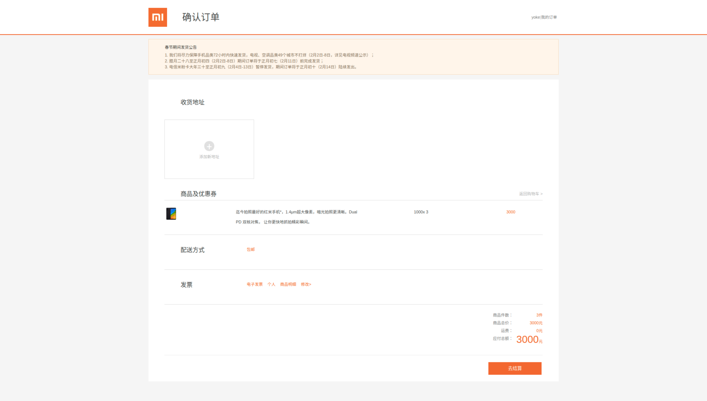

# Poseidon


## 1. 说明

> Poseidon采用微服务架构方式,基于SpringCloud+SpringBoot+Mybatis Plus的商城系统。主要包括包括前台商城系统和后台管理系统。
>
>
> 如果该项目对您有帮助，您可以点一下右上角的"star" 支持一下 谢谢!
>
> 或者可以"follow"一下,该项目会一直持续更新,不断添加新功能和优化
>
> 该项目仅用于学习，没有任何商业用途，如有侵权，立即删除。
>
> 由于服务太多，资金匮乏，运行时如果出什么问题，可以联系我。

## 2. 组织结构
```
Poseidon
├── psd-config -- 通用配置 
├── psd-discovery -- Eureka注册中心 -- port: 8761
├── psd-elastic-search -- 基于Elasticsearch的商品搜索,推荐服务 -- port: 9300
├── psd-gateway -- 网关服务 -- port: 8769
├── psd-generate -- 采用Mybatis Generator自动生成代码
├── psd-member -- 用户服务 -- port: 9000
├── psd-order -- 订单服务 -- port: 9100
├── psd-web-auth -- JWT用户登录服务 --port: 9200
├── psd-web-shop-cart -- 购物车服务 --port: 8090
└── psd-web-view -- 商品展示服务 --port: 8080
```



## 3. 所用技术

### 3.1 后端技术

|     技术名称     |        说明        |                    链接                     |
| :--------------: | :----------------: | :-----------------------------------------: |
|   SpringCloud    |   微服务构建框架   |   http://spring.io/projects/spring-cloud    |
|    SpringBoot    |    容器+MVC框架    |   https://spring.io/projects/spring-boot    |
|     Mybatis      |      ORM框架       |      http://www.mybatis.org/mybatis-3       |
| MybatisGenerator | 文件结构和代码生成 |                                             |
|   MybatisPlus    |    Mybatis增强     |           https://mp.baomidou.com           |
|    Swagger-UI    |    文档生产工具    | <https://github.com/swagger-api/swagger-ui> |
|  Elasticsearch   |      搜索引擎      |           https://www.elastic.co            |
|     RabbitMq     |      消息队列      |         <https://www.rabbitmq.com/          |
|      Redis       |     分布式缓存     |              https://redis.io               |
|      Druid       |    数据库连接池    |      https://github.com/alibaba/druid       |
|      Docker      |       容器化       |             https://docker.com              |
|     JWT验证      |      JWT登录       |               https://jwt.io                |

### 3.2 前端技术

| 技术名称 |   说明   |        链接         |
| :------: | :------: | :-----------------: |
|  React   | 前端框架 | https://reactjs.org |

## 4. 效果图

由于本人前端一般，前端大致与小米商城的样式类似

#### 4.1 首页



#### 4.2 购物车




#### 4.3 订单页



#### 4.4 个人中心

## 5. Poseidon构建与运行

### 5.1 后台搭建

#### 5.1.1  环境搭建

* 安装`JDK 8`或者更高的版本,程序中用到了`java 8`中的函数式编程的一些东西
* 安装`Mysql`,`DB.sql`文件在DB文件夹下,可以直接导入
* 安装Gradle,安装`Redis`,`ElasticSearch`,`RabbitMQ`
* `application-dev.yml`中的数据库配置需要变成自己的配置

#### 5.1.2  启动的先后顺序

* 启动 `psd-discovery`模块
* 启动 `psd-web-view`模块
* 启动 `psd-web-shop-cart`模块
* 启动 `psd-web-auth` 模块
* 启动 `psd-web-member` 模块
* 启动 `psd-web-es` 模块
* 启动 `psd-web-order` 模块
* 启动 `psd-gateway` 模块

#### 5.1.3  开发环境

* 可直接在` IntelliJ IDEA`进行二次开发

### 5.2 前台搭建

poseidon前台地址: https://github.com/Saseke/poseidon-front

#### 5.2.1 环境的搭建

* 安装`node`,配置好环境变量
* `npm install`

#### 5.2.2 开发环境

* 可直接在`WebStorm`进行二次开发

## 6 相关链接
* 邮箱:  `1538341848@qq.com`
* 博客:  http://songmengyuan.me

